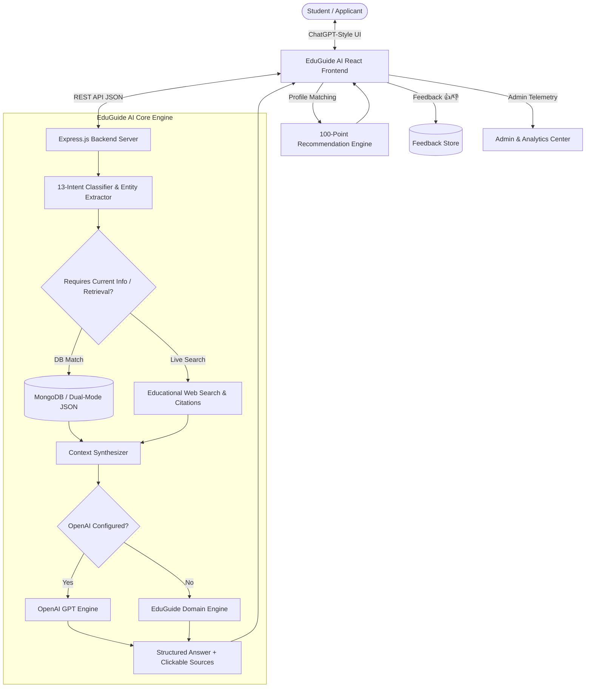

# 🌍 EduGuide AI: Global Education & Career Assistant

[](https://nodejs.org/)
[](https://reactjs.org/)
[](https://vitejs.dev/)
[](https://openai.com/)
[](https://www.mongodb.com/)
[](LICENSE)

> **B.Tech AI & Data Science Capstone Project**  
> *Tagline:* **Your Global Education & Career Assistant**

EduGuide AI is a full-stack, production-ready AI platform providing verified global education guidance across **Universities**, **Scholarships**, **Placements**, **Courses**, **Admissions**, **Entrance Exams**, and **Study Abroad**. It combines **13-intent educational NLP classification**, a **100-point scholarship matching engine**, **official source citations**, **dual-mode MongoDB/JSON storage**, and **ChatGPT-inspired conversation ergonomics**.

---

## 1. Problem Statement & Solution

### The Problem
Prospective students and young professionals face high friction and misinformation when planning higher education:
- Fragmented, outdated, and unverified data regarding international tuition fees and admission criteria.
- Complex and opaque scholarship eligibility criteria leading to missed deadlines.
- Unrealistic and fabricated placement salary statistics on generic forums.
- Generic AI chatbots hallucinating admission dates, fees, and immigration rules.

### The EduGuide AI Solution
- **Specialized AI Engine**: Strictly grounded educational prompt engineering with 13-domain intent classification and entity extraction.
- **Clickable Official Citations**: Prioritizes `.gov`, `.edu`, and accredited scholarship commissions (DAAD, Chevening, Fulbright, Campus France, EduCanada).
- **100-Point Recommendation Engine**: Multi-criteria matching algorithm evaluating student profiles against global scholarships with score breakdown and tier ratings.
- **Live Verified Database**: Seeded database of world-class universities, realistic placement records, and entrance exam structures.

---

## 2. Final System Architecture



---

## 3. Technology Stack

| Layer | Technologies | Purpose |
|---|---|---|
| **Frontend** | React 18, Vite, Lucide React Icons | Minimalist, conversation-first responsive UI |
| **Styling** | Vanilla CSS Design System | Dark-first theme (`#212121`, `#171717`, `#2F2F2F`), custom scrollbars, Inter typography |
| **Backend** | Node.js (ES Modules), Express.js | Modular RESTful API backend, rate limiting, and CORS |
| **AI / LLM** | OpenAI Node.js SDK + Local Synthesizer | Live OpenAI synthesis with automatic local fallback |
| **NLP Engine** | In-House Intent Classifier & Entity Extractor | Regex + rule tokenization for 13 educational intents |
| **Matching Algorithm** | 100-Point Scholarship Recommendation Engine | Multi-factor weighted scoring across 6 academic dimensions |
| **Database** | MongoDB (Mongoose) + Dual-Mode JSON Storage | Scalable cloud MongoDB Atlas support + instant zero-setup local fallback |

---

## 4. Query Intent Classification & Entity Extraction

EduGuide AI classifies user queries into 13 discrete intents:

```text
ADMISSION      → Entry requirements, deadlines, application documents
SCHOLARSHIP    → Funding levels, stipends, tuition waivers, eligibility
UNIVERSITY     → Global rankings, campus locations, institution overviews
COURSE         → Degree programs, syllabi, duration, credits
PLACEMENT      → Average salaries, highest CTC, placement percentages, hiring firms
INTERNSHIP     → Research assistantships, co-ops, summer internships
STUDY_ABROAD   → Living costs, blocked accounts, immigration guidelines
EXAM           → IELTS, TOEFL, GRE, GMAT, SAT, GATE test patterns and fees
TUITION        → Cost of attendance, semester charges, payment modes
CAREER         → Industry roles, career trajectories, postgraduate scope
VISA           → Post-study work permits (PSW), student residence permits
GENERAL        → Conceptual guidance and introductory advice
OUT_OF_SCOPE   → Non-educational requests (politely redirected)
```

### Entity Extraction Example
**Query:** *"Find fully funded scholarships for computer science in Germany."*
```json
{
  "intent": "SCHOLARSHIP",
  "entities": {
    "country": "Germany",
    "field": "Computer Science",
    "degree": null,
    "funding": "Fully Funded"
  },
  "requiresCurrentInfo": true,
  "confidence": 0.85
}
```

---

## 5. 100-Point Scholarship Recommendation Engine

The recommendation engine compares student profiles against scholarship requirements:

$$\text{Total Score} = \text{Country (20)} + \text{Degree (20)} + \text{Field (20)} + \text{CGPA (20)} + \text{Nationality (10)} + \text{Language (10)}$$

### Scoring Weights
1. **Country Match (20 Points)**: Matches target country or international consortium.
2. **Degree Match (20 Points)**: Matches Undergraduate, Masters, PhD, or Postdoc.
3. **Field of Study Match (20 Points)**: Matches Computer Science, STEM, Business, etc.
4. **Academic CGPA (20 Points)**: Full score if $\ge$ minimum cutoff; scaled if within 0.5.
5. **Nationality (10 Points)**: Matches eligible countries or international quota.
6. **Language Proficiency (10 Points)**: Student IELTS/TOEFL meets standard threshold.

### Match Tiers
- **90 – 100**: 🟢 `Excellent Match`
- **75 – 89**: 🔵 `Strong Match`
- **60 – 74**: 🟡 `Possible Match`
- **Below 60**: ⚪ `Low Match`

---

## 6. Main Application Navigation

- **`/` (Chat Assistant)**: ChatGPT-style minimalist conversational interface with recent chat sessions, quick prompt cards, and source citations.
- **`/scholarships` (Scholarship Finder & Matcher)**: Filter global scholarships by Country, Degree, and Funding, or trigger the 100-Point Match Engine against your saved Student Profile.
- **`/universities` (Universities Explorer)**: Search 25+ world-class institutions (MIT, Stanford, Oxford, Cambridge, TUM, IIT Madras, NUS, Toronto) with QS rankings and tuition data.
- **`/placements` (Placement & Salary Explorer)**: Verified compensation statistics, highest international packages, and top hiring firms.
- **`/study-abroad` (Study Abroad Guides)**: Destination guides for Germany, USA, UK, Canada, Australia, and Singapore covering blocked accounts, tuition, and Post-Study Work Visas.
- **`/exams` (Exams Directory)**: Test structures, fees, durations, and booking portals for IELTS, TOEFL, GRE, GMAT, SAT, and GATE.
- **`/profile` (Student Profile Center)**: Manage your academic background, test scores, and country preferences.
- **`/admin` (Admin & Analytics Portal)**: KPI metrics, live inquiry telemetry, Knowledge Base manager, and unanswered queries review.

---

## 7. REST API Endpoints

| Method | Endpoint | Description |
|---|---|---|
| `GET` | `/api/health` | Backend status, AI engine mode, and DB state |
| `POST` | `/api/chat` | Main query processing (Intent classification, DB retrieval, AI synthesis) |
| `GET` | `/api/scholarships` | Retrieve scholarships with country, degree, funding, and field filters |
| `POST` | `/api/scholarships/match` | 100-point scholarship recommendation against student profile |
| `POST` | `/api/scholarships` | Add new scholarship to Knowledge Base |
| `GET` | `/api/universities` | Retrieve global universities with search and country filters |
| `GET` | `/api/universities/:id` | Get individual university details |
| `GET` | `/api/placements` | Get placement and compensation reports |
| `GET` | `/api/courses` | Get degree programs and curricula |
| `GET` | `/api/exams` | Get standardized exam guides |
| `GET` | `/api/profile` | Get current student profile |
| `POST` | `/api/profile` | Save/update student profile |
| `POST` | `/api/feedback` | Submit 👍 Helpful or 👎 Not Helpful feedback |
| `GET` | `/api/unanswered` | List unanswered and out-of-scope query backlog |
| `PATCH` | `/api/unanswered/:id` | Update query backlog status (`resolved`, `added_to_faq`) |
| `GET` | `/api/analytics` | Aggregated telemetry, KPIs, and category statistics |

---

## 8. Quick Start & Installation

### Prerequisites
- **Node.js**: v18.0 or later
- **npm**: v9.0 or later

### Installation Steps

1. **Clone the repository:**
   ```bash
   git clone https://github.com/your-username/eduguide-ai.git
   cd Wiz.AI
   ```

2. **Setup Backend:**
   ```bash
   cd backend
   npm install
   cp .env.example .env
   ```
   *(Optional: Add your `OPENAI_API_KEY` and `MONGODB_URI` to `backend/.env`)*

3. **Setup Frontend:**
   ```bash
   cd ../frontend
   npm install
   ```

4. **Run the Backend Server:**
   ```bash
   cd ../backend
   npm start
   ```
   *Runs at `http://localhost:5001`*

5. **Run the Frontend Development Server:**
   ```bash
   cd ../frontend
   npm run dev
   ```
   *Runs at `http://localhost:3000`*

---

## 9. Running Automated Tests

Run the complete test suite covering Intent Classification, Entity Extraction, 100-Point Recommendation Scoring, and NLP matching:

```bash
cd backend
npm test
```

### Test Results:
```text
TAP version 13
# Subtest: CampusConnect Backend Service Integration Tests
ok 1 - FAQ Service: retrieves 30+ FAQs and categories
ok 2 - FAQ Service: filters FAQs by category
ok 3 - Feedback Service: saves positive and negative feedback without duplication
ok 4 - Unanswered Service: logs low-confidence questions and updates status

# Subtest: EduGuide AI - Intent Classification & Entity Extraction Tests
ok 1 - Scholarship Intent: "Find fully funded scholarships for computer science in Germany."
ok 2 - Placement Intent: "What is the average placement package at IIT Madras?"
ok 3 - Admission Intent: "What are the admission requirements for MIT?"
ok 4 - Exam Intent: "What is IELTS and what is the test structure?"
ok 5 - Out of Scope Intent: "Write me a Python game."
ok 6 - General Query: "What is a scholarship?"

# Subtest: EduGuide AI - 100-Point Scholarship Recommendation Engine Tests
ok 1 - Calculates score and assigns Excellent Match for high-fit profile
ok 2 - Ranks scholarships correctly with matchScholarshipsForStudent

# Subtest: NLP Engine Unit Tests
ok 1 - tokenize filters stop words and normalizes tokens
ok 2 - stemWord correctly stems common word variations
ok 3 - cosineSimilarity correctly scores identical and orthogonal vectors
ok 4 - fuzzySimilarity handles minor typos

# tests 21 | suites 4 | pass 21 | fail 0
```

---

## 10. Deployment Guidelines

### Frontend (Vercel / Netlify)
- Root Directory: `frontend`
- Build Command: `npm run build`
- Output Directory: `dist`
- Environment Variables: `VITE_API_URL=https://your-backend-api.onrender.com/api`

### Backend (Render / Railway)
- Root Directory: `backend`
- Build Command: `npm install`
- Start Command: `node server.js`
- Environment Variables:
  - `PORT=5001`
  - `OPENAI_API_KEY=your-api-key`
  - `MONGODB_URI=mongodb+srv://<user>:<password>@cluster.mongodb.net/eduguide_ai`

---

## 11. Limitations & Future Roadmap

- **Current Limitations**:
  - Live visa and legal immigration advice is provided strictly as high-level informational summaries and users are directed to official embassies.
  - Multi-language intent parsing is currently optimized for English queries.
- **Future Roadmap**:
  - Multilingual voice chat interface with speech-to-text.
  - Integration with official university application APIs for automated document pre-screening.
  - Student visa appointment tracker and deadline alert notifications.
